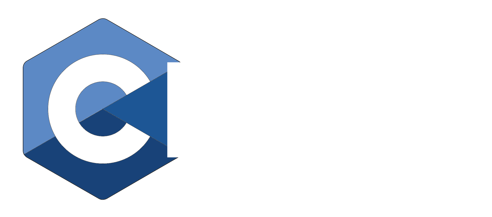

# CLI20 - A C++20 typed-schema command-line parser

[](docs/static/img/logo.png)

[](https://github.com/gen740/CLI20/actions/workflows/ci.yml)

A C++20 typed-schema command-line parser.
Define your CLI as a type, not as a builder.

```cpp
#include "cli/argument.hh"
#include "cli/parser.hh"

struct Args {
  cli::Flag<"verbose", 'v'> verbose;
  cli::StringOption<"output", 'o'> output;
  cli::Positional<std::string, cli::nargs::one_or_more> inputs;
};

auto main(int argc, char* argv[]) -> int {
  const auto args = cli::parse_or_exit<Args>(argc, argv);
}
```

CLI11 was great.  
C++ has moved on.

## cli20 in one line

`cli20` is a header-only C++20 CLI parser that treats your command line as a typed schema, not a mutable runtime parser object.

## Why cli20?

Most C++ CLI parsers were designed around C++11 constraints:

- runtime builder APIs
- string-based option lookup
- callback-oriented parsing
- mutable parser graphs
- macro-heavy configuration

`cli20` takes a different approach.

Instead of building a parser object, you define your CLI directly as a type.

C++20 gives us:

- compile-time string literals
- concepts
- constexpr-friendly APIs
- typed schemas
- cleaner metaprogramming

`cli20` is built around those capabilities from the start.

## CLI11 vs cli20

CLI11:

```cpp
CLI::App app{"my app"};
bool verbose = false;
std::string output;

app.add_flag("-v,--verbose", verbose);
app.add_option("-o,--output", output);
```

cli20:

```cpp
struct Args {
  cli::Flag<"verbose", 'v'> verbose;
  cli::StringOption<"output", 'o'> output;
};

const auto args = cli::parse_or_exit<Args>(argc, argv);
```

`cli20` treats your CLI as a typed schema, not as a mutable runtime parser object.

## Quick Start

```cpp
#include <iostream>

#include "cli/argument.hh"
#include "cli/parser.hh"

struct BuildArgs {
  cli::Flag<"release", 'r'> release{
      {.help = "Build with optimizations"}};
  cli::IntOption<"jobs", 'j'> jobs{
      {.help = "Parallel jobs", .presence = cli::required}};
};

struct Args {
  cli::Description description{"A tiny build tool powered by cli20."};

  cli::Help<> help{{.help = "Show help"}};
  cli::Flag<"verbose", 'v'> verbose{{.help = "Enable verbose logging"}};
  cli::StringOption<"output", 'o'> output{{.help = "Output path"}};

  cli::Positional<std::string, cli::nargs::one_or_more> inputs{
      {.help = "Input files", .presence = cli::required}};

  cli::Command<"build", BuildArgs> build{
      {.help = "Run the build subcommand"}};
};

auto main(int argc, char* argv[]) -> int {
  const auto args = cli::parse_or_exit<Args>(argc, argv);

  if (args.verbose.value()) {
    std::cout << "verbose enabled\n";
  }

  for (const auto& input : args.inputs.value()) {
    std::cout << "input: " << input << '\n';
  }

  if (args.build.provided()) {
    std::cout << "jobs: " << *args.build.jobs.value() << '\n';
  }

  return 0;
}
```

## Built-in Help

Built-in help is one field:

```cpp
cli::Help<> help;
```

That expands to `--help` and `-h`, prints generated help, and exits successfully. Combined with `cli::parse_or_exit()`, help handling does not need parser-specific boilerplate.

If you want to wire help explicitly, the action pipeline is also available:

```cpp
cli::ArgImpl<
    "help", 'h', cli::nargs::none,
    cli::action::print_help | cli::action::exit_success>
    help;
```

## Subcommands

```cpp
struct BuildArgs {
  cli::Flag<"release", 'r'> release;
  cli::IntOption<"jobs", 'j'> jobs;
};

struct Args {
  cli::Command<"build", BuildArgs> build;
};
```

Subcommands are just nested typed schemas.

## Features

- C++20-native API design
- Header-only
- Support for C++20 modules
- Typed command schemas
- Compile-time option names
- Strongly typed positional arguments
- Recursive subcommands
- Zero runtime string registry
- `ParseResult<T>`-based parsing
- Custom validation and conversion pipelines
- Automatic help generation
- No macros

## Using C++20 Modules

cli20 provides full support for C++20 modules via the `cli20.cppm` module file.

### Building with Modules

To enable module support, configure your CMake build with the module option:

```bash
cmake -B build -DCXX_CLI20_ENABLE_MODULE=ON
cmake --build build
```

### Using the cli20 Module

Instead of including header files, you can import the module using `import cli20;`.

See [apps/example_module.cc](apps/example_module.cc) for a complete example.

### Module Availability

Within this repository, the module target is named `cli20-module`:

```cmake
target_link_libraries(your_target PRIVATE cli20-module)
```

After installing `cli20` and using `find_package(cli20 CONFIG REQUIRED)`, use the exported target:

```cmake
target_link_libraries(your_target PRIVATE cli20::module)
```

## Core Design Principles

- Your CLI is a type, not a builder script.
- Field order defines positional structure.
- Option names are compile-time data.
- Subcommands compose by nesting structs.
- The sugar API should cover the common case.
- Lower-level action pipelines should remain available when needed.

## Sugar API

The main API lives in [`include/cli/argument.hh`](include/cli/argument.hh).

### Flags

```cpp
cli::Flag<"verbose", 'v'> verbose;   // stores bool
cli::Help<> help;                     // --help / -h, print & exit
cli::Help<"usage", 'u'> usage;        // custom name
```

### Options

```cpp
// Generic form
cli::Option<int, "port", 'p'> port;
cli::ListOption<std::string, "include", 'I'> include_dirs;

// Convenience aliases for common types
cli::StringOption<"config", 'c'> config;
cli::IntOption<"port", 'p'> port;
cli::DoubleOption<"ratio"> ratio;
cli::PathOption<"output"> output;
```

Scalar options store `std::optional<T>`. List options store `std::vector<T>`.

### Positionals

```cpp
cli::Positional<std::string> src;                          // optional<string>
cli::Positional<std::string, cli::nargs::one_or_more> files; // vector<string>
cli::Positional<int> count;
```

If `nargs.max == 1`, storage is `std::optional<T>`.  
If `nargs.max != 1`, storage is `std::vector<T>`.

## Philosophy

`cli20` is built around one idea:

Your command line interface is data.

Not a mutable parser object.  
Not a callback graph.  
Not a string registry.  
A typed schema.

This enables:

- cleaner APIs
- better compile-time guarantees
- easier tooling
- simpler validation
- more maintainable command structures

## Going Beyond Sugar

When you need stronger behavior, use `ArgImpl` directly with a custom action pipeline.

Actions can be composed with `|`:

```cpp
cli::ArgImpl<
    "config", 'c', cli::nargs::one,
    cli::conversion::path
        | cli::validation::exists
        | cli::validation::is_regular_file
        | cli::pack::set_once>
    config{{.help = "Configuration file"}};
```

Each `|` appends a step to the pipeline. `Action<...>` with explicit template arguments is equivalent and can be used when you prefer the explicit form:

```cpp
cli::ArgImpl<
    "config", 'c', cli::nargs::one,
    cli::Action<
        cli::conversion::path,
        cli::validation::exists,
        cli::validation::is_regular_file,
        cli::pack::set_once>{}>
    config{{.help = "Configuration file"}};
```

The action pipeline is split into three layers:

- `conversion::*` — parse the raw string into a typed value
- `validation::*` — reject out-of-range or otherwise invalid values
- `pack::*` — store the final value into the field

## Comparison with CLI11

CLI11 is a strong library from the C++11 era.

`cli20` is not trying to reproduce that design with newer syntax. It makes a different architectural choice:

- schema types instead of builder objects
- compile-time option metadata instead of runtime string registration
- nested structs instead of parser graph mutation
- typed fields instead of callback-oriented configuration

CLI11 was designed around C++11 constraints.  
`cli20` is what a CLI parser looks like when designed around C++20 from the beginning.

## Installation

Copy `include/` into your project and add it to your include path.

```cmake
add_library(cli20 INTERFACE)
target_include_directories(cli20 INTERFACE path/to/cli20/include)
target_compile_features(cli20 INTERFACE cxx_std_20)
```

If you install the library with CMake, you can link the exported target instead:

```cmake
find_package(cli20 CONFIG REQUIRED)

add_executable(my_app main.cc)
target_link_libraries(my_app PRIVATE cli20::cli20)
```

If you want to fetch it directly from a source checkout, `FetchContent` also works:

```cmake
include(FetchContent)

FetchContent_Declare(
  cli20
  GIT_REPOSITORY https://github.com/gen740/CLI20.git
  GIT_TAG v0.1.1-pre
)
FetchContent_MakeAvailable(cli20)

add_executable(my_app main.cc)
target_link_libraries(my_app PRIVATE cli20::cli20)
```

## Development

```bash
cmake -S . -B build -DCXX_CLI20_ENABLE_TEST=ON
cmake --build build
ctest --test-dir build --output-on-failure
```
